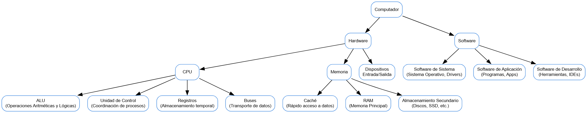

# Actividad 1: El Computador Digital Moderno

## Introducción

En este documento se presenta una investigación sobre los conceptos fundamentales de un computador, sus arquitecturas, componentes de hardware y software, y el proceso de funcionamiento desde el encendido hasta la ejecución de operaciones. Se incluyen definiciones oficiales, ejemplos, diagramas y referencias bibliográficas de fuentes confiables.

---

## 1. ¿Qué es un computador?

Un **computador** es un dispositivo electrónico capaz de recibir, procesar y almacenar información mediante la ejecución de instrucciones programadas. En términos oficiales, la definición puede encontrarse en documentos de organismos de estandarización como el IEEE:

> *"Un computador es un sistema electrónico que manipula datos según un conjunto de instrucciones definidas, permitiendo almacenar, procesar y recuperar información de forma automatizada."*  
> — *IEEE Standard Dictionary of Electrical and Electronics Terms, IEEE Std 100-2004.*

Otra definición complementaria es la de Stallings (2009):

> *"Un computador es una máquina que realiza operaciones aritméticas y lógicas sobre datos, guiado por un conjunto de instrucciones que definen su comportamiento."*  
> — Stallings, W. (2009). **Computer Organization and Architecture: Designing for Performance.**

---

## 2. Arquitecturas de un Computador

### Definición General

La **arquitectura de un computador** se refiere a la estructura y diseño fundamental de un sistema informático, abarcando la interconexión de sus componentes (CPU, memoria, dispositivos de E/S, etc.) y la forma en que se comunican para ejecutar programas.

### 2.1 Arquitectura CISC (Complex Instruction Set Computer)

- **Definición:**  
  La arquitectura CISC se caracteriza por tener un conjunto amplio y complejo de instrucciones, en el cual cada instrucción puede realizar múltiples operaciones a nivel de hardware.
  
- **Construcción y Aplicaciones:**  
  - Es común en sistemas de escritorio y servidores, por ejemplo, en la arquitectura x86 utilizada en la mayoría de las PCs.
  - Permite instrucciones que pueden realizar tareas complejas en una sola operación, facilitando la programación a costa de una mayor complejidad en el hardware.

- **Referencia:**  
  Hennessy, J. L., & Patterson, D. A. (2011). *Computer Architecture: A Quantitative Approach.*

### 2.2 Arquitectura RISC (Reduced Instruction Set Computer)

- **Definición:**  
  La arquitectura RISC se basa en un conjunto reducido de instrucciones simples, lo que permite una ejecución más rápida y eficiente de cada instrucción.

- **Construcción y Aplicaciones:**  
  - Se utiliza en dispositivos móviles y sistemas embebidos, como los procesadores ARM presentes en smartphones y tablets.
  - La simplicidad de sus instrucciones favorece la optimización del rendimiento y la eficiencia energética.

- **Referencia:**  
  Patterson, D. A., & Hennessy, J. L. (2005). *Computer Organization and Design: The Hardware/Software Interface.*

---

## 3. ¿Qué es el Hardware?

El **hardware** comprende los componentes físicos que integran un sistema informático. A continuación, se detallan los elementos más relevantes:

### 3.1 CPU (Unidad Central de Procesamiento)

- **Definición:**  
  La CPU es el "cerebro" del computador, encargada de interpretar y ejecutar las instrucciones de los programas.

- **Partes Relevantes:**
  - **ALU (Unidad Aritmético Lógica):**  
    - *Definición y Función:* Realiza operaciones aritméticas (como suma y resta) y lógicas (como comparaciones y operaciones booleanas).
  - **Unidad de Control:**  
    - *Definición y Función:* Dirige el flujo de datos e instrucciones dentro de la CPU, coordinando la ejecución de operaciones.
  - **Registros:**  
    - *Definición y Función:* Son pequeñas áreas de almacenamiento interno que retienen datos e instrucciones temporales para acceso rápido.
  - **Buses:**  
    - *Definición y Función:* Son canales de comunicación internos que transfieren datos, direcciones y señales de control entre la CPU y otros componentes del sistema.

### 3.2 Memoria

- **Registros:**  
  Memoria de alta velocidad dentro de la CPU para almacenar datos e instrucciones en uso inmediato.
  
- **Caché:**  
  Memoria intermedia que acelera el acceso a datos frecuentemente utilizados, ubicada entre la CPU y la memoria principal.
  
- **Memoria Principal (RAM):**  
  Almacena temporalmente programas y datos mientras el computador está en funcionamiento.
  
- **Memoria Secundaria:**  
  Dispositivos de almacenamiento a largo plazo, como discos duros y unidades de estado sólido (SSD).

### 3.3 Dispositivos de Entrada/Salida (E/S)

Son dispositivos que permiten la interacción entre el usuario y la computadora, tales como:
- **Entrada:** Teclado, ratón, micrófono, escáner.
- **Salida:** Monitor, impresora, altavoces.

### 3.4 Buses de Datos

Son sistemas de comunicación que conectan la CPU, memoria y dispositivos periféricos, facilitando la transferencia de datos y señales de control entre ellos.

---

## 4. ¿Qué es el Software?

El **software** es el conjunto de programas y datos que instruyen al hardware sobre cómo realizar tareas específicas. Se clasifica en tres grandes categorías:

### 4.1 Software de Sistema

Incluye el **sistema operativo** (por ejemplo, Windows, Linux, macOS), controladores y utilidades que gestionan los recursos del computador y proporcionan una plataforma para la ejecución de aplicaciones.

### 4.2 Software de Aplicación

Son programas diseñados para realizar tareas específicas para el usuario, como:
- Procesadores de texto.
- Navegadores web.
- Herramientas multimedia.

### 4.3 Software de Desarrollo

Conjunto de herramientas y entornos que facilitan la creación, depuración y mantenimiento de otros programas, tales como:
- Editores de código.
- Compiladores.
- Entornos de desarrollo integrado (IDE).

---

## 5. Funcionamiento del Computador

### 5.1 Procesos al Encender una Computadora

Cuando se enciende un computador se desencadena una serie de procesos:
1. **POST (Power-On Self Test):**  
   El sistema realiza una prueba de diagnóstico para verificar el funcionamiento correcto de los componentes hardware.
2. **Carga del BIOS/UEFI:**  
   Se inicia el firmware que configura y pone en funcionamiento el hardware.
3. **Carga del Sistema Operativo:**  
   El sistema operativo se carga desde la memoria secundaria (disco duro/SSD) a la memoria principal (RAM), preparando el entorno para la ejecución de programas.

### 5.2 Del Teclado a la Pantalla: Flujo de Datos

1. **Entrada de Datos:**  
   Al presionar una tecla, el dispositivo de entrada (teclado) convierte la acción en señales eléctricas.
2. **Procesamiento:**  
   La CPU recibe las señales, interpreta la instrucción y ejecuta la operación correspondiente.
3. **Salida de Información:**  
   Los resultados se envían a través de la tarjeta gráfica al dispositivo de salida (monitor), mostrando el resultado al usuario.

### 5.3 Codificación Interna de los Datos

Internamente, los datos se representan en **sistema binario** (utilizando 0s y 1s). Cada dígito binario, o **bit**, es la unidad mínima de información. Las combinaciones de bits forman bytes y otras unidades mayores, permitiendo la codificación de caracteres, números e instrucciones.

### 5.4 Unidades de Medida de Datos

- **Bit:**  
  La unidad básica de información (0 o 1).
- **Byte:**  
  Equivale a 8 bits.
- **Otras unidades:**  
  Kilobyte (KB), Megabyte (MB), Gigabyte (GB), Terabyte (TB), etc.

---

## Mapa Conceptual de la Investigación

A continuación se presenta un ejemplo de mapa conceptual que resume los temas investigados:

