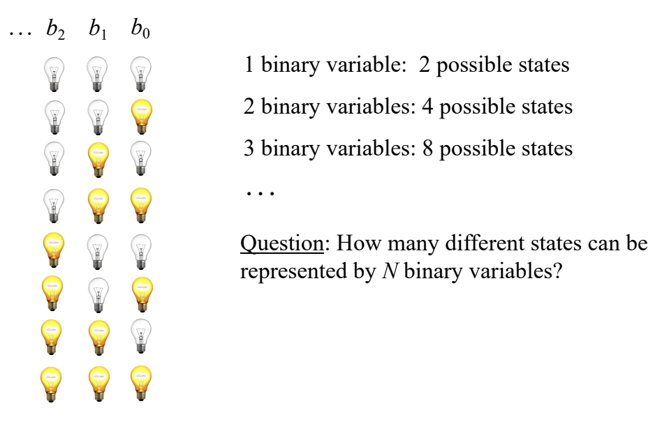

# Actividad 2: Representación de datos digitales

## Ejercicio 1

En la Figura 2 se muestran los diferentes estados que se pueden representar usando una palabra binaria de 3 bits. Responde la pregunta de la imagen: ¿Cuántos estados diferentes se pueden representar usando N bits?

Se pueden representar $2^N$ estados usando $N$ bits.

## Para la bitácora

1. Las computadoras almacenan y procesan información utilizando un sistema binario, donde los datos se representan mediante combinaciones de ceros y unos. Este sistema es la base del hardware y software, ya que los circuitos electrónicos solo pueden diferenciar entre dos estados: encendido (1) y apagado (0). Para representar números, se utilizan sistemas como el binario y el complemento a dos. Las letras y caracteres se codifican a través de estándares como ASCII o Unicode, mientras que las imágenes y otros archivos multimedia se almacenan como secuencias de bits organizadas según formatos específicos, como JPEG o MP3.

2. En la Figura 2 se plantea la pregunta sobre cuántos estados diferentes pueden representarse con $N$ variables binarias. Como se explicó anteriormente, cada bit tiene dos posibles valores: 0 o 1. Entonces, al combinar $N$ bits, la cantidad total de combinaciones posibles es $2^N$. Esto significa que si se utilizan más bits, se pueden representar más estados o valores diferentes.