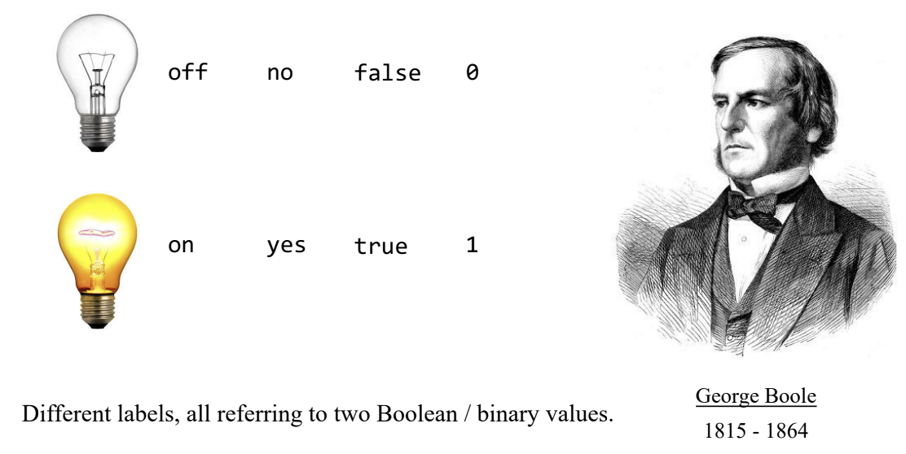

# Actividad 2: Representación de datos digitales

## Ejercicio 1

En la Figura 2 se muestran los diferentes estados que se pueden representar usando una palabra binaria de 3 bits. Responde la pregunta de la imagen: ¿Cuántos estados diferentes se pueden representar usando N bits?

Se pueden representar $2^N$ estados usando $N$ bits.

## Para la bitácora

1. Las computadoras almacenan y procesan información utilizando un sistema binario, donde los datos se representan mediante combinaciones de ceros y unos. Este sistema es la base del hardware y software, ya que los circuitos electrónicos solo pueden diferenciar entre dos estados: encendido (1) y apagado (0). Para representar números, se utilizan sistemas como el binario y el complemento a dos. Las letras y caracteres se codifican a través de estándares como ASCII o Unicode, mientras que las imágenes y otros archivos multimedia se almacenan como secuencias de bits organizadas según formatos específicos, como JPEG o MP3.

2. En la Figura 2 se plantea la pregunta sobre cuántos estados diferentes pueden representarse con $N$ variables binarias. Como se explicó anteriormente, cada bit tiene dos posibles valores: 0 o 1. Entonces, al combinar $N$ bits, la cantidad total de combinaciones posibles es $2^N$. Esto significa que si se utilizan más bits, se pueden representar más estados o valores diferentes.

### 3. Unidades de almacenamiento

| Unidad      | Símbolo | Prefijo | Equivalencia en bytes |
|------------|---------|---------|----------------------|
| Byte       | B       | -       | 8 bits               |
| Kilobyte   | KB      | Kilo-   | 10³ |
| Megabyte   | MB      | Mega-   | 10⁶ |
| Gigabyte   | GB      | Giga-   | 10⁹ |
| Terabyte   | TB      | Tera-   | 10¹² |
| Petabyte   | PB      | Peta-   | 10¹⁵ |
| Exabyte    | EB      | Exa-    | 10¹⁸ |

### George Bool

El trabajo de George Boole fue fundamental en la computación moderna, ya que desarrolló el álgebra booleana, un sistema matemático basado en la lógica binaria. Su teoría permitió la creación de circuitos lógicos en computadoras, donde los valores 0 y 1 se utilizan para realizar operaciones lógicas y aritméticas. Gracias a sus aportes, hoy en día es posible diseñar procesadores y sistemas digitales eficientes.

# Sistemas numércos

## Ejercicio 2 - Resuelve y deja evidencia en la bitácora

- $1010101010_2$
- $11111_2$
- $10000000_2$
- $100100100_2$

## Ejercicio 2 - Resuelve y deja evidencia en la bitácora

- $127_{10}$
- $246_{10}$
- $1025_{10}$
- $354_{10}$

# Tipos de datos

## 3 y 4. Actividad de investigación (para la bitácora)

| Tipo de Dato      | C            | Java      | Python   |
|-------------------|--------------|-----------|----------|
| Entero            | int          | int       | int      |
| Byte              | x            | byte      | x        |
| Short             | short        | short     | x        |
| Long              | long         | long      | x        |
| Long Long         | long long    | x         | x        |
| Flotante          | float        | float     | float    |
| Doble             | double       | double    | x        |
| Carácter          | char         | char      | x        |
| Booleano          | bool/_Bool   | boolean   | bool     |
| Cadena de Texto   | x            | String    | str      |
| Complejo          | x            | x         | complex  |
