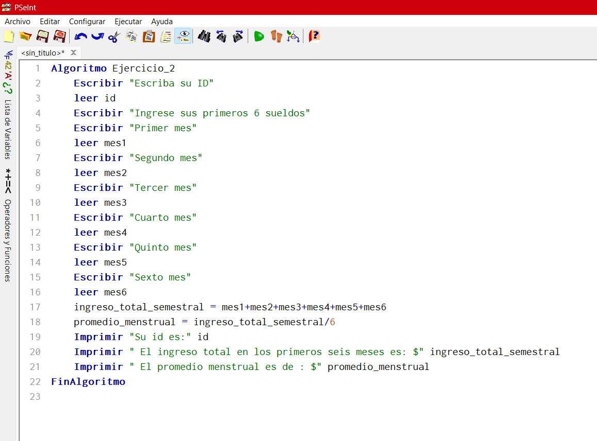
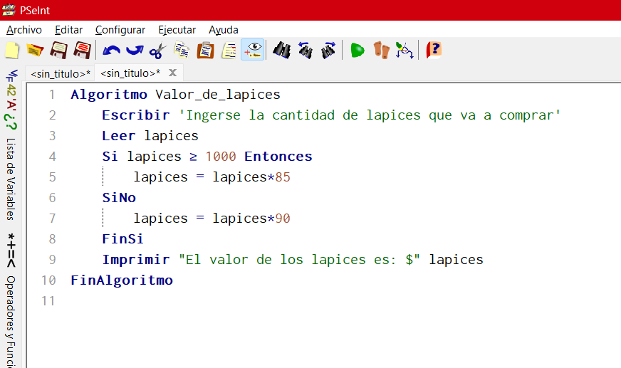
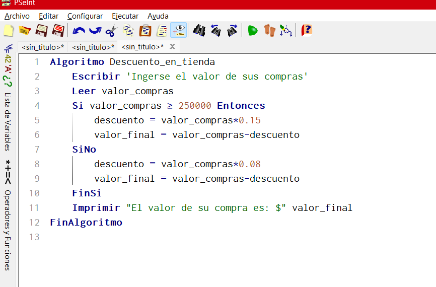
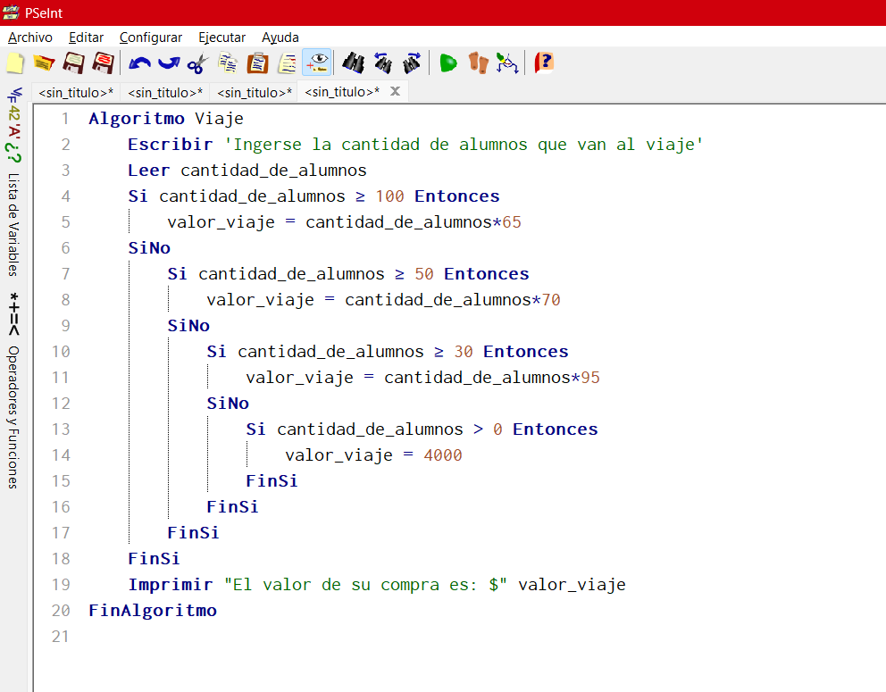

# Actividad 3: Algoritmos

## Ejercicio 1

1. **Óvalo → Inicio / Fin**
- Representa el punto de inicio y de finalización del algoritmo.

2. **Paralelogramo → Entrada / Salida**
- Se usa para representar la entrada de datos (input) y la salida de resultados (output).

3. **Rectángulo → Proceso**
- Indica operaciones como cálculos, asignaciones de valores, entre otras.

4. **Rombo → Decisión**
- Representa una bifurcación en el flujo, dependiendo de una condición lógica (ej. "Si X es mayor que Y").

5. **Flechas → Conector de Flujo**
- Indican la dirección en la que fluye el algoritmo.

6. **Círculo → Conector**
- Se usa para enlazar partes del diagrama cuando es necesario continuar el flujo en otra ubicación del mismo.

## Ejercicio 2

### Pseudocódigo

### Diagrama de flujo

## Ejercicios para practicar

1. ### Pseudocódigo

### Diagrama de flujo

2. ### Pseudocódigo

### Diagrama de flujo

3. ### Pseudocódigo

### Diagrama de flujo

## Actividad de Evaluación: Comprensión de Conceptos

### Parte 1: Identificar Algoritmos

Responde si los siguientes enunciados representan un algoritmo. Justifica la respuesta:

**1. Una página web.**

❌Rta/ No es un algoritmo porque una página web es un conjunto de elementos visuales e interactivos que no necesariamente siguen una secuencia de pasos finita para resolver un problema.

**2. Una receta para hacer un pastel, donde se indican ingredientes y pasos a seguir.**

✅ Rta/ Sí es un algoritmo porque presenta un conjunto de instrucciones ordenadas y precisas (mezclar ingredientes, hornear, enfriar, etc.), lo que lleva a un resultado final (el pastel).

**3. "Piensa en un número y multiplícalo por otro".**

❌ Rta/ No es un algoritmo porque no define claramente qué número tomar ni qué hacer con el resultado después de la multiplicación. No hay un objetivo claro ni una serie de pasos estructurados con un fin determinado.

**4. Un manual de instrucciones para armar un mueble, con pasos detallados y un orden claro.**

✅ Rta/ Sí es un algoritmo porque presenta una secuencia de pasos ordenados para alcanzar un objetivo final (el mueble armado). Además, las instrucciones son precisas y finitas.

**5. Una lista de compras organizada en orden alfabético**

❌ Rta/ No es un algoritmo porque simplemente es una colección de elementos sin una secuencia de pasos a seguir. Aunque el orden alfabético puede ser resultado de un algoritmo de ordenamiento, la lista en sí misma no es un algoritmo, ya que no indica instrucciones para realizar una tarea.

---

### Parte 2: Variables y Constantes

Indica si las siguientes afirmaciones describen una variable o una constante:

1. El valor de la gravedad en la Tierra, 9.8 m/s². (**Constante**)

2. La edad de una persona calculada en base al año actual y su año de nacimiento. (**Variable**)

3. La cantidad de dinero en una cuenta bancaria. (**Variable**)

4. La velocidad de la luz en el vacío, 299,792,458 m/s. (**Constante**)

5. El radio de un círculo. (**Variable**)

---

### Parte 3: Características de los Algoritmos

Responde si los siguientes enunciados cumplen con las características de un algoritmo. Justifica la respuesta:

1. Para elegir la ruta más corta entre varias ciudades, el algoritmo examina rutas candidatas, deteniéndose cuando los cambios en la distancia parecen lo suficientemente pequeños.

❌ No cumple completamente, ya que la condición de parada es ambigua y podría no ser finito. Además, no está claramente definido cómo se evalúan las rutas.

2. Suma los números ingresados y muestra el resultado.

✅ Sí cumple, porque tiene pasos bien definidos, es finito y produce una salida clara (la suma de los números ingresados).

3. Un conjunto de pasos para calcular el área de un rectángulo dado su base y altura.

✅ Sí cumple, ya que sigue pasos específicos, tiene entrada (base y altura), salida (el área) y se ejecuta en un número finito de pasos.

4. El algoritmo cuenta el número de votos obtenidos por cada uno de los candidatos de una elección para presidente. Empieza solicitando el nombre del candidato y finaliza cuando se ingresa el valor -1.

✅ Sí cumple, porque cuenta votos de manera ordenada, tiene una condición de parada clara (-1) y genera un resultado bien definido.

---

### Parte 4: Comprensión de Herramientas

Indica si las siguientes afirmaciones son ciertas o falsas respecto al pseudocódigo y diagramas de flujo:

1. El pseudocódigo utiliza símbolos estándar para representar las operaciones lógicas.

- ❌ Falso, porque el pseudocódigo usa una estructura escrita similar a un lenguaje de programación, pero no emplea símbolos estándar como los diagramas de flujo.

2. Los diagramas de flujo son una representación gráfica de un algoritmo.

- ✅ Verdadero, ya que los diagramas de flujo representan visualmente los pasos de un algoritmo mediante símbolos y conexiones.

3. El pseudocódigo debe estar escrito en un lenguaje de programación específico.

- ❌ Falso, porque el pseudocódigo no está ligado a un lenguaje de programación específico; su propósito es describir la lógica de un algoritmo de manera comprensible.

4. Un diagrama de flujo siempre debe tener un inicio y un fin claramente definidos.

- ✅ Verdadero, ya que un diagrama de flujo debe tener un punto de inicio y un punto de fin para garantizar que el proceso esté bien definido.

---

### Parte 5: Estructuras de Control

Las estructuras de control permiten definir el flujo de ejecución de un algoritmo, determinando qué instrucciones se ejecutan y en qué orden. Estas pueden ser condicionales (ejecutan acciones según una condición) o cíclicas (repiten un bloque de código mientras se cumpla una condición).

#### Ejemplo de la vida diaria:

Decidir si llevar sombrilla dependiendo del clima. Di esta lloviendo si llevar, si esta haciendo sol, no llevar.

🔹 Estructura condicional:

Si está lloviendo, entonces llevar sombrilla, sino salir sin sombrilla.

---

#### Ejemplo con cálculos matemáticos:

La materia se apruba con 3.0. Por lo tanto si el promedio mio en esa materia es igual a 3 o mas, aprobe, sino reprobe.

🔹 Estructura condicional con cálculo:

Si promedio >= 3.0, entonces "Aprobado", sino "Reprobado".
