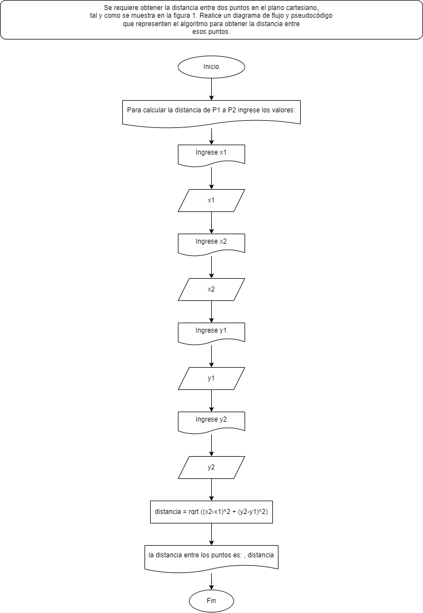
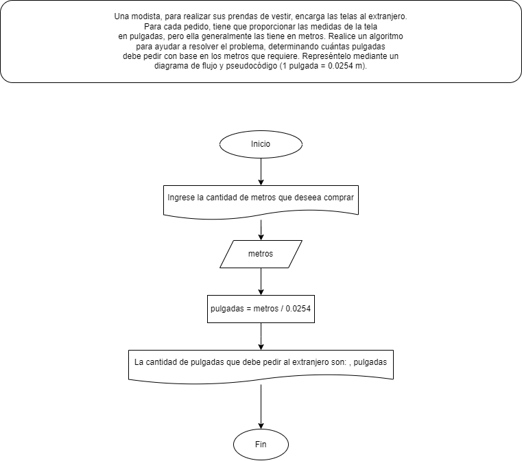
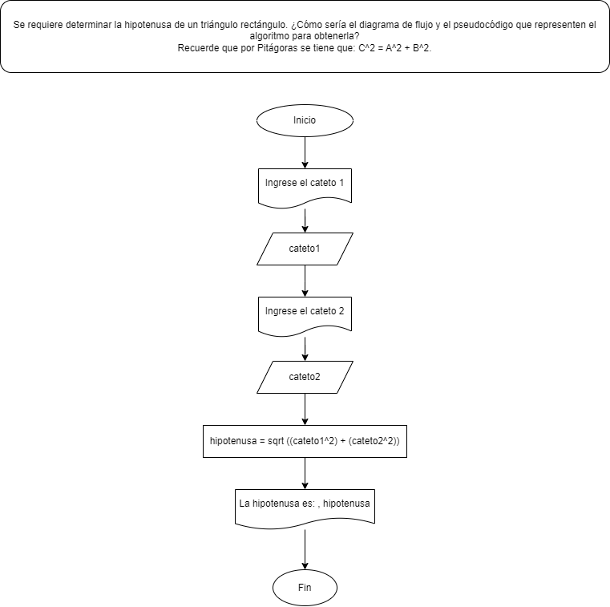

# Retos

## Reto 1
### Diagrama de flujo



### Pseudocódigo

```
Algoritmo Distancia_entre_dos_puntos
    Escribir "Para calcular la distancia de P1 a P2 ingrese los valores:"
    Escribir "Ingrese x1"
    leer x1
    Escribir "Ingrese x2"
    leer x2
    Escribir "Ingrese y1"
    leer y1
    Escribir "Ingrese y2"
    leer y2
    distancia = rc ((x2-x1)^2 + (y2-y1)^2)
    Imprimir "La distancia entre los puntos es:" distancia
FinAlgoritmo
```
## Reto 2

### Diagrama de flujo



### Pseudocódigo
```
Algoritmo Metros_a_pulgadas
    Escribir "Ingrese la cantidad de tela en metros que desea comprar"
    leer metros
    pulgadas = metros / 0.0254
    Imprimir "La cantidad de pulgadas que debe pedir al extranjero son:" pulgadas
FinAlgoritmo
```
## Reto 3

### Diagrama de flujo



### Pseudocódigo
```
Algoritmo Pitagoras
    Escribir "Ingrese el cateto 1"
    leer cateto1
    Escribir "Ingrese el cateto 2"
    leer cateto2
    hipotenusa = rc [(cateto1^2)+(cateto2^2)]
    Imprimir "La hipotenusa es:" hipotenusa
FinAlgoritmo
```

## Reto 4

### Pseudocódigo
```
Algoritmo Edad_de_la_persona
    Escribir "Ingrese su fecha de nacimiento"
    Escribir "Ingrese el dia"
    leer dia
    Escribir "Ingrese el mes"
    leer mes
    Escribir "Ingrese el año"
    leer año
    Escribir "Ingrese la fecha actual"
    Escribir "Ingrese el dia actual"
    leer dia_actual
    Escribir "Ingrese el mes actual"
    leer mes_actual
    Escribir "Ingrese el año actual"
    leer año_actual
    año_cumpleaños = año_actual - año
    mes_cumpleaños = mes_actual - mes
    Si mes_actual - mes < 0 Entonces
        año_cumpleaños = año_cumpleaños - 1
    SiNo
        Si dia_actual - dia < 0 Entonces
            año_cumpleaños = año_cumpleaños - 1
        SiNo
            Si dia_actual - dia = 0 Entonces
                Escribir "Hoy es su cumpleaños, ¡Feliz Cumpleaños!"
                año_cumpleaños = año_cumpleaños
            FinSi
        FinSi
    FinSi
    Imprimir "Usted tiene:", año_cumpleaños, "años"
FinAlgoritmo
```

## Reto 5

### Pseudocódigo
``` 
Algoritmo Sueldo_semanal
    Escribir "Para calcular su sueldo semanal"
    Escribir "Ingrese el numero de horas tranajadas"
    leer horas_trabajadas
    sueldo = horas_trabajadas * pago_por_hora
    Si horas_trabajadas > 50 Entonces
        Escribir "No esta permitido trabajar mas de 50 horas"
    SiNo
        Escribir "Ingrese pago que recibe por hora"
        leer pago_por_hora
        Si horas_trabajadas < 41 Entonces
            sueldo = horas_trabajadas * pago_por_hora
        SiNo
            Si horas_trabajadas > 40 Entonces
                sueldo = horas_trabajadas * (2 * pago_por_hora)
            SiNo
                Si horas_trabajadas > 45 Entonces
                    sueldo = horas_trabajadas * (3 * pago_por_hora)
                FinSi
            FinSi
        FinSi
        Imprimir "Su sueldo semanal es: $" sueldo " pesos"
    FinSi
FinAlgoritmo
```


## Reto 6

### Pseudocódigo
``` 
Algoritmo Evaluar_numeros
	Escribir "Ingrese la cantidad de numeros que va a evaluar"
	leer n
	Repetir
		Escribir "Ingrese un numero"
		leer num
		Si num > 0 Entonces
			contador_positivo = contador_positivo + 1
		SiNo
			Si num < 0 Entonces
				contador_negativo = contador_negativo + 1
			SiNo
				Si num = 0 Entonces
					contador_cero = contador_cero + 1
				FinSi
			FinSi	
		FinSi
		contador = contador + 1
	Hasta Que contador = n
	Escribir "La cantidadd de numeros positivos es:" contador_positivo
	Escribir "La cantidadd de numeros nwgativos es:" contador_negativo
	Escribir "La cantidadd de ceros es:" contador_cero
FinAlgoritmo
```

## Reto 8

### Pseudocódigo
```
Algoritmo Articulos
	Escribir "Ingrese la cantidad de articulos que va a comprar"
	leer n
	a = 0
	Repetir
		Escribir "Ingrese el precio del articulo"
		leer precio
		Si precio >= 200 Entonces
			descuento = precio*0.15
			precio_final = precio - descuento
		SiNo
			Si precio >= 100 Entonces
				descuento = precio*0.12
				precio_final = precio - descuento
			SiNo
				Si precio >= 0 Entonces
					descuento = precio*0.10
					precio_final = precio - descuento
				FinSi
			FinSi
		FinSi
		Escribir "El descuento del articulo es: $" descuento
		Escribir "El precio final del articulo  es: $" precio_final
		contador = contador + 1
		a = a + precio_final
		b = a
	Hasta Que contador = n
	precio_total <- b
	Escribir "El precio total de los articulos es: $" precio_total
FinAlgoritmo
```

## Reto 9

### Pseudocódigo
```
Algoritmo Funcion_exponencial
    Escribir "Ingrese el valor de x:"
    Leer x
    Escribir "Ingrese el número de términos n:"
    Leer n
    resultado <- 1
    Para i <- 1 Hasta n Hacer
        potencia <- 1
        factorial <- 1
        Para j <- 1 Hasta i Hacer
            potencia <- potencia * x
            factorial <- factorial * j
        FinPara
        resultado <- resultado + (potencia / factorial)
    FinPara
    Escribir "El valor aproximado de e^x es: " resultado
FinAlgoritmo
```

## Reto 10

### Pseudocódigo
```
Algoritmo Funcion_esponencial_seno_del_angulo
    Escribir "Ingrese el valor de x en radianes:"
    Leer x
    Escribir "Ingrese el número de términos n:"
    Leer n
    resultado <- 0
    signo <- 1
    Para i <- 1 Hasta (2*n-1) Con Paso 2 Hacer
        potencia <- 1
        factorial <- 1
        Para j <- 1 Hasta i Hacer
            potencia <- potencia * x
            factorial <- factorial * j
        FinPara
        resultado <- resultado + (signo * (potencia / factorial))
        signo <- signo * (-1)
    FinPara	
    Escribir "El valor aproximado de sin(x) es: " resultado
FinAlgoritmo
```